# Diagramma flussi bot — versione semplificata (non tecnica)

Stesso diagramma di prima, con linguaggio semplice (niente nomi di funzioni/codice). I comandi (es. `/pausa`, `/acquisto`) sono lasciati come sono perché già noti.

Le **fasi sono ora raggruppate in un'unica zona**, in ordine, ciascuna etichettata come `FASE X - Cosa fa`, così sono facili da riconoscere e seguire in sequenza.

**Legenda colori:**

| Colore | Fase | Significato |
|--------|------|--------------|
| 🔵 blu | — | Come arriva il messaggio (canali) |
| 🟢 verde | FASE 0 | Prima del pagamento: informazioni e vendita |
| 🟡 giallo | FASE 1 | Benvenuto + prima parte del questionario |
| 🟠 arancio | FASE 2 | Seconda parte del questionario |
| 🟣 viola | FASE 5 | Conferma fine questionario |
| 🔷 azzurro | FASE 3 | Piano in preparazione |
| 🟩 verde scuro | FASE 4 | Percorso attivo |
| ⚪ grigio | FASE 99 | In pausa (risponde solo Paola) |
| 🟤 marrone | — | Comandi manuali di Paola |

```mermaid
flowchart TD
    WA["📩 Arriva un messaggio WhatsApp"]:::entry
    TG["💬 Paola scrive su Telegram"]:::entry
    GHL["🌐 Arriva un nuovo lead dal CRM (GoHighLevel)"]:::entry
    BG["⏱️ Controllo automatico ogni minuto"]:::entry

    WA --> ISADMIN{"È un comando manuale<br/>di Paola?"}
    ISADMIN -->|sì| ADMIN_CMD
    ISADMIN -->|no| FASE

    TG --> TGCMD{"Paola ha scritto<br/>un comando?"}
    TGCMD -->|no| MANUALREPLY["Il messaggio di Paola viene<br/>inviato alla mamma su WhatsApp"]:::admin
    TGCMD -->|sì| ADMIN_CMD

    FASE{"In che punto del percorso<br/>si trova questa mamma?"}:::entry

    %% ============================================================
    %% TUTTE LE FASI, RAGGRUPPATE E IN ORDINE
    %% ============================================================
    subgraph FASI["📍 LE FASI DEL PERCORSO — in ordine"]
        direction TB

        subgraph S0["FASE 0 - Prima del pagamento (informazioni e vendita)"]
            direction TB
            MAIN0["Gestione conversazione<br/>pre-vendita"]:::f0
            MAIN0 --> STOPCHK{"La mamma chiede di<br/>non essere più contattata?"}:::f0
            STOPCHK -->|sì| STOP["Messaggio di conferma<br/>e stop ai contatti futuri"]:::f0
            STOPCHK -->|no| SPECIALCHK{"Richiesta particolare?<br/>(assistenza, rinnovo, guide)"}:::f0
            SPECIALCHK -->|sì| PAUSA99A["Risposta breve, poi<br/>si passa la mano a Paola<br/>+ avviso su Telegram"]:::f99
            SPECIALCHK -->|no| CHOICE{"La mamma stava scegliendo<br/>tra più opzioni?"}:::f0

            CHOICE -->|"guide o percorso completo"| TIER["Le viene riproposta<br/>la scelta tra guide (37€)<br/>o percorso completo"]:::f0
            CHOICE -->|"stava per acquistare"| PURCHFLOW["→ si procede con l'acquisto<br/>oppure con le guide"]:::f0
            CHOICE -->|"voleva informazioni"| FIRSTQ["Viene fatta una prima<br/>domanda per capire la situazione"]:::f0
            CHOICE -->|no| METAFORM{"Ha risposto a un modulo<br/>Facebook/Instagram?"}:::f0

            METAFORM -->|sì| FORMSTEP["Percorso guidato in 4 passi:<br/>presentazione → prima risposta<br/>→ proposta → offerta inviata"]:::f0
            METAFORM -->|no| ACQCTX{"Ha comunicato di<br/>aver pagato?"}:::f0

            ACQCTX -->|no| SILENCE{"È solo un saluto o<br/>un ringraziamento finale?"}:::f0
            SILENCE -->|sì| MARKSIL["Nessuna risposta necessaria"]:::f0
            SILENCE -->|no| ROUTER["Il messaggio viene analizzato<br/>per capire cosa vuole la mamma"]:::f0

            ROUTER --> HOLD{"È un caso delicato che<br/>richiede Paola?"}:::f0
            HOLD -->|sì| PAUSA99A
            HOLD -->|no| AIRESP["Viene generata una risposta<br/>(pronta o scritta su misura)<br/>seguendo le regole commerciali"]:::f0

            AIRESP --> AFTER["Si aggiorna lo stato<br/>della conversazione"]:::f0

            ACQCTX -->|sì| ACQDECIDE{"Che tipo di acquisto<br/>ha comunicato?"}:::f0
            ACQDECIDE -->|"non chiaro"| CHIARIMENTO["Le viene chiesto<br/>di chiarire cosa ha acquistato"]:::f0
            ACQDECIDE -->|"solo guide 37€"| GUIDE37["Conferma acquisto guide<br/>(resta in FASE 0,<br/>niente questionario)"]:::f0
            ACQDECIDE -->|"da confermare tipo"| TIERWAIT["Le viene chiesto di confermare<br/>quale prodotto ha scelto"]:::f0
            ACQDECIDE -->|"percorso completo confermato"| SEQ["🚀 SI PASSA ALLA FASE 1"]:::f1
        end

        subgraph S1["FASE 1 - Benvenuto e prima parte del questionario"]
            direction TB
            CONS1START["Invio benvenuto + regole<br/>+ prima parte del questionario"]:::f1
            CONS1START --> CONS1["Attesa risposte<br/>alla prima parte"]:::f1
            CONS1 -->|"risponde più tardi<br/>o fa una domanda"| CONS1G["Risposta breve,<br/>si resta in attesa"]:::f1
            CONS1 -->|"ha risposto a tutto"| TOFASE2["✅ SI PASSA ALLA FASE 2"]:::f2
        end

        subgraph S2["FASE 2 - Seconda parte del questionario"]
            direction TB
            CONS2START["Invio seconda parte<br/>del questionario"]:::f2
            CONS2START --> CONS2["Attesa risposte<br/>alla seconda parte"]:::f2
            CONS2 -->|"risponde più tardi<br/>o fa una domanda"| CONS2G["Risposta breve,<br/>si resta in attesa"]:::f2
            CONS2 -->|"ha risposto a tutto"| TOFASE5["✅ SI PASSA ALLA FASE 5"]:::f5
        end

        subgraph S5["FASE 5 - Conferma fine questionario"]
            direction TB
            CONS5["Si chiede alla mamma se<br/>ha finito di rispondere"]:::f5
            CONS5 --> CONFCHK{"Ha confermato<br/>di aver finito?"}:::f5
            CONFCHK -->|"non ancora"| CONS5
            CONFCHK -->|"sì"| TOFASE3["✅ SI PASSA ALLA FASE 3"]:::f3
        end

        subgraph S3["FASE 3 - Piano in preparazione"]
            direction TB
            CONS3["Il piano personalizzato viene<br/>programmato per essere inviato<br/>entro un'ora"]:::f3
            CONS3 -.->|"nel frattempo il bot<br/>non risponde ai messaggi,<br/>solo Paola può farlo"| WAITBG(("⏳ in attesa<br/>dell'invio automatico")):::f3
            WAITBG --> SENDPIANO["Viene generato e inviato<br/>il piano personalizzato"]:::f3
            SENDPIANO -->|"✅ inviato con successo"| TOFASE4["✅ SI PASSA ALLA FASE 4"]:::f4
            SENDPIANO -->|"❌ errore di invio"| RETRY["Si riprova automaticamente<br/>dopo 10 minuti"]:::f3
            RETRY --> WAITBG
        end

        subgraph S4["FASE 4 - Percorso attivo (supporto continuo)"]
            direction TB
            CONS4["Supporto continuo durante<br/>il percorso"]:::f4
            CONS4 --> C4CHK{"Che tipo di messaggio<br/>è arrivato?"}:::f4
            C4CHK -->|"risposta a un<br/>controllo periodico"| C4PAUSE["Si passa la mano a Paola<br/>+ avviso su Telegram"]:::f99
            C4CHK -->|"giorni dal piano<br/>e ci sono difficoltà"| C4ALERT["Avviso a Paola<br/>+ si passa la mano"]:::f99
            C4CHK -->|"conversazione normale"| C4AI["Il bot risponde in modo<br/>colloquiale, restando nel tema<br/>del percorso"]:::f4
        end

        subgraph S99["FASE 99 - In pausa"]
            direction TB
            P99["⏸️ Paola vede il messaggio<br/>su Telegram ma il bot<br/>non risponde da solo"]:::f99
        end

        S0 --> S1 --> S2 --> S5 --> S3 --> S4
        S4 -.->|"dopo giorni di pausa<br/>indicati sopra"| S99
    end

    FASE -->|"FASE 0"| MAIN0
    FASE -->|"FASE 1"| CONS1
    FASE -->|"FASE 2"| CONS2
    FASE -->|"FASE 5"| CONS5
    FASE -->|"FASE 3"| CONS3
    FASE -->|"FASE 4"| CONS4
    FASE -->|"FASE 99"| P99

    GHL --> TEMPLATE["Invio automatico del primo messaggio<br/>(sonno o spannolinamento)<br/>→ si parte dalla FASE 0"]:::f0
    TEMPLATE -.->|quando la mamma risponde| WA
    TEMPLATE --> MAIN0

    BG --> BGCHECK{"cosa controlla<br/>ogni minuto"}:::entry
    BGCHECK -->|"è ora di inviare<br/>un piano programmato?"| WAITBG
    BGCHECK -->|"messaggi arrivati<br/>di notte (23:00-07:00)?"| WAKE["Vengono gestiti<br/>appena inizia la giornata"]:::entry

    %% ============================================================
    %% COMANDI MANUALI DI PAOLA
    %% ============================================================
    subgraph ADMIN["🛠️ COMANDI MANUALI DI PAOLA"]
        direction TB
        ADMIN_CMD{"Comando ricevuto"}:::admin
        ADMIN_CMD -->|"/acquisto, /acquisto_sonno,<br/>/acquisto_spannolinamento"| CADM_ACQ["Forza l'inizio<br/>della FASE 1"]:::admin
        ADMIN_CMD -->|"/q1, /q2"| FORCEQ["Forza l'invio del<br/>questionario scelto<br/>(FASE 1 o 2)"]:::admin
        ADMIN_CMD -->|"/piano"| SENDPIANOF["Forza l'invio immediato<br/>del piano (FASE 3→4)"]:::admin
        ADMIN_CMD -->|"/checkup"| CHECKUP["Invia un controllo<br/>periodico personalizzato<br/>(durante la FASE 4)"]:::admin
        ADMIN_CMD -->|"/revisione"| REVISION["Invia un piano<br/>aggiornato (FASE 4)"]:::admin
        ADMIN_CMD -->|"/continua, /rispondi"| FORCED["Forza una risposta del bot<br/>(funziona anche in pausa)"]:::admin
        ADMIN_CMD -->|"/inizia"| INIZIA["Attiva direttamente<br/>la FASE 4"]:::admin
        ADMIN_CMD -->|"/pausa"| SETPAUSA["Metti il bot in<br/>FASE 99 (pausa)"]:::admin
        ADMIN_CMD -->|"/riprendi"| SETRIP["Riattiva il bot<br/>sulla FASE 4"]:::admin
        ADMIN_CMD -->|"/fase N"| SETFASE["Sposta manualmente la mamma<br/>in una fase specifica"]:::admin
        ADMIN_CMD -->|"/contatta_sonno,<br/>/contatta_spannolinamento,<br/>/contatta_pannolino"| OUTREACH["Contatta manualmente<br/>un nuovo lead<br/>(parte dalla FASE 0)"]:::admin
        ADMIN_CMD -->|"/nota, /scrivi"| NOTE["Nota interna<br/>o invio libero"]:::admin
    end

    CADM_ACQ -.-> SEQ
    FORCEQ -.-> CONS1START
    SENDPIANOF -.-> SENDPIANO
    CHECKUP -.-> CONS4
    REVISION -.-> CONS4
    INIZIA -.-> CONS4
    SETPAUSA -.-> P99
    SETRIP -.-> CONS4
    SETFASE -.-> FASE
    OUTREACH -.-> TEMPLATE

    classDef entry fill:#cfe8ff,stroke:#1565c0,stroke-width:2px,color:#0d3b66
    classDef f0 fill:#d9f7be,stroke:#2e7d32,stroke-width:2px,color:#1b3a1b
    classDef f1 fill:#fff3b0,stroke:#a68b00,stroke-width:2px,color:#4d3d00
    classDef f2 fill:#ffd8a8,stroke:#c2610b,stroke-width:2px,color:#5c2c00
    classDef f5 fill:#e0bbff,stroke:#7b1fa2,stroke-width:2px,color:#3a0a4d
    classDef f3 fill:#a5d8ff,stroke:#1864ab,stroke-width:2px,color:#0a2f4d
    classDef f4 fill:#b2f2bb,stroke:#2b8a3e,stroke-width:2px,color:#0f3d1a
    classDef f99 fill:#e9ecef,stroke:#495057,stroke-width:2px,color:#212529
    classDef admin fill:#e8c9a3,stroke:#8a4b08,stroke-width:2px,color:#3d2200
```

